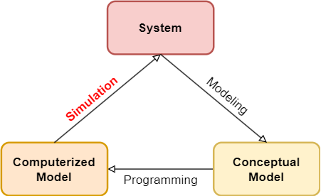
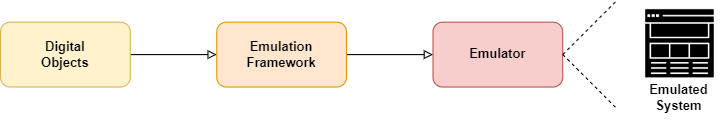
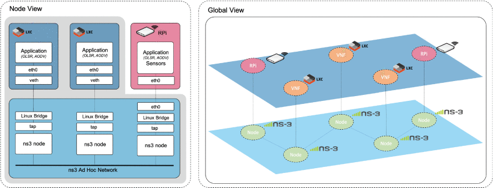

## Simulation and Emulation

### Simulation

Simulation主要指通过计算机模拟真实世界的过程或系统。

Simulation的重要过程包括模型的建立、执行、优化等。下图表示了一个包括Simulation的模型验证细化周期。这也说明了Simulation的工作主要围绕着仿真模型展开。

一个典型的Simulation样例是天气预报。天气预报模型会根据可观察到的参数进行调整，并基于已有的信息对短期天气做出预测。

### Emulation

Emulation的目标是在一种计算机系统上运行另一种计算机系统。

Emulator实际上执行被模拟的进程或系统，因此Emulation不仅适用于真实世界模型，还可以被用于复制具体系统的运行。

基于上述特征，Emulator经常在软硬件结合的环境中工作。一个常见的Emulator的例子就是虚拟机，它实现了在物理机限制的环境中运行使用另一种架构或系统的应用程序。

如图所示，Emulator通常基于仿真框架来创建，而仿真框架的实现则要求对仿真目标软硬件环境的数字化描述。

### Simulation&Emulation的异同

Simulation和Emulation之间的区别主要在于它们的目的和方法。Simulation则旨在模拟现实世界的过程或系统，以便可以预测它们可能会如何行动或反应，而Emulation旨在复制另一个系统的行为，以便可以在不同的硬件或软件环境中运行该系统。

Simulation专注于系统模型，旨在模拟导致最终结果的某些条件和操作。Emulation提供了一个重新创建的环境来观察这些条件并像在原始系统中一样执行这些操作。

虽然Simulation和Emulation有着不同的目的，但它们之间也存在相互关系。例如，在进行模拟时，需要对模拟环境进行仿真，以便能够精确地模拟真实环境中的各种因素。此外，在进行系统仿真时，可能需要使用某些模拟工具来模拟系统中的各个组成部分，这就涉及到Emulation的概念。因此，Simulation和Emulation并非孤立的概念，它们之间存在紧密的联系和相互作用。

### Simulation和Emulation结合

> A. Sobeih et al., "J-Sim: a simulation and emulation environment for wireless sensor networks," in IEEE Wireless Communications, vol. 13, no. 4, pp. 104-119, Aug. 2006, doi: 10.1109/MWC.2006.1678171. 【SCI I】

作者在这篇文章中按照建模、模拟（Simulation）、仿真框架（Emulation framework）的流程，构建了组合网络仿真环境 J-Sim。

在测试方面，在 J–Sim 和 ns-2 中模拟 WSN 场景来凭经验评估模拟框架【Emulation】。然后通过进行大规模成熟的未来作战系统 (FCS) 模拟【Emulation】，在现实场景中演示 WSN 模拟框架的使用（指将虚拟仿真环境与少量真实硬件设备集成在一起，以方便对真实网络进行性能评估。）【Emulation】。

> V. Sanchez-Aguero, F. Valera, B. Nogales, L. F. Gonzalez and I. Vidal, "VENUE: Virtualized Environment for Multi-UAV Network Emulation," in IEEE Access, vol. 7, pp. 154659-154671, 2019, doi: 10.1109/ACCESS.2019.2949119.【JCR Q2】

这篇文章的主要内容是VENUE（Virtualized Environment for multi-UAV network emulation，虚拟环境多无人机网络仿真）平台的构建，VENUE涵盖了从模拟【Simulation】/仿真阶段【Emulation】到真实的设备集成阶段的所有工作。

### 例：女巫攻击——Simulation

女巫攻击（Sybil Attack）是指攻击者通过创建多个虚假身份来欺骗系统，从而控制网络的一种攻击方式。在仿真环境中，实现女巫攻击需要按照以下步骤进行：

1. 设计对等网络：首先需要设计一个对等网络，其中包含多个节点和连接这些节点的边缘。
2. 创建虚假身份：攻击者可以通过创建多个虚假身份来实施女巫攻击。这些虚假身份应该与正常节点具有相似的特征，例如相似的传输协议和端口号、相似的交互模式等。攻击者可以利用自动化程序或手动方式创建这些虚假身份。
3. 模拟攻击：攻击者可以使用各种技术实施女巫攻击，包括欺骗、窃听和篡改数据流等。攻击者可以利用虚假身份发送虚假信息、劫持其他节点之间的通信或阻止其他节点之间的通信。
4. 监测结果：最后，需要监测仿真环境中的网络行为，并查看是否存在异常行为或异常节点。通过对节点的密度、连接模式等进行分析，可以确定是否发生了女巫攻击。

### 例2：跨架构固件检测——Emulation

固件跨架构检测是指在不同处理器架构的设备上运行的固件中查找漏洞和恶意代码的过程。在模拟环境中实现固件跨架构检测需要按照以下步骤进行：

1. 选择模拟器：首先需要选择一个支持多种处理器架构的模拟器。例如，QEMU模拟器可以模拟多种处理器架构的系统，包括x86、ARM和MIPS等。
2. 准备固件：准备要分析的固件，并将其加载到模拟器中。
3. 运行模拟器：通过配置模拟器，选择目标处理器架构和操作系统版本，启动模拟器，并加载固件。
4. 执行静态分析：使用工具对固件进行静态分析，以查找其中的漏洞和恶意代码。例如，可以使用IDA Pro或Ghidra等反汇编器来对固件进行分析。
5. 执行动态分析：在模拟器中执行固件，并监视其行为。例如，可以使用Strace来监视系统调用、使用Wireshark来监视网络流量等。
6. 检测漏洞和恶意代码：通过静态和动态分析的结果，检测固件中的漏洞和恶意代码。可以使用开源或商业工具来辅助检测。

### 总结

综上所述，要将Simulation下的女巫攻击环境迁移到类似跨架构固件检测的Emulation环境中，需要考虑不同的场景和目标：

1. 需要模拟能够发射无线电磁波的设备，并将其与受害者的计算机建立连接，在发射无线电磁波的同时监测并窃取接收到的数据，软件定义无线电设备是一种选择。
2. 可能还存在其他困难，需要继续研究。